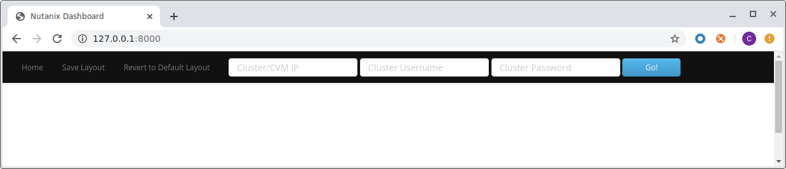

External Scripts
################

We're going to use quite a few external/third-party packages in this lab.  These packages manage, amongst other things, how our application **looks**.

Because there's no need for us to write these packages ourselves, we can grab them from their original sources and simply copy them into our app.

Checking directory structure
............................

#. Create the following directories.  Windows users can create new folders using Windows Explorer.

   - **public/css**
   - **public/css/fonts**
   - **public/css/vendor**
   - **public/js**
   - **public/js/vendor**

   Commands to create these folders, if required, are as follows:

   .. code-block:: bash

      mkdir public/css
      mkdir public/css/fonts
      mkdir public/css/vendor
      mkdir public/js
      mkdir public/js/vendor

#. Create the following files.  They can both remain empty for now.  Windows users can create new files using Notepad (remember to save the file type as "All Files").

   - **public/css/ntnx.css**
   - **public/js/ntnx.js**   

Adding packages
...............

#. Download each resources file linked below and extract it into the appropriate directory.

   - `CSS <https://github.com/nutanixdev/lab-assets/blob/master/php-lab-v3/resources/css-vendor.zip?raw=true>`_ - extract to **public/css/vendor**
   - `Javascript <https://github.com/nutanixdev/lab-assets/blob/master/php-lab-v3/resources/js-vendor.zip?raw=true>`_ - extract to **public/js/vendor**
   - `Fonts <https://github.com/nutanixdev/lab-assets/blob/master/php-lab-v3/resources/fonts.zip?raw=true>`_ - extract to **public/css/fonts**

   .. note::
   
      When extracting the ZIP files, ensure they are extracted **directly** to the directories above and not into subdirectories.

   Here is how the app's **public** directory structure should look at the completion of this step:

   .. figure:: images/public_structure.png

Further testing
...............

With these files in place, our application is starting to not only come together, but also starting to look a lot better.

The navigation bar and form elements at the top of the screen are now styled properly with both colours and fonts.

It's now time to dig deeper into wiring our app into the Nutanix REST APIs.