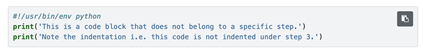

How to Follow this Lab
######################

Each lab is broken into sub-sections, one for each of the relevant topics.

Required Steps
--------------

When a section requires you to carry out specific ordered steps, each step will be bullet-pointed:

- Step 1
   - Sub-task within step 1
- Step 2
- Step 3
   - Sub-task within step 3

Additional Notes
----------------

A specific section's related details or important information will be shown as a highlighted note:

.. note::

   This is a note, and should be read as accompanying information for the section or step above.

Code Samples
------------

Many sections and steps through the Nutanix Developer labs will be accompanied with code samples or code you should copy & paste, or add to a file.  When a code block relates to a specific section or step, it will be included/indented as part of the section or step contents.  An example is shown below.

- Step 1 has related code below:

   .. code-block:: python

      #!/usr/bin/env python
      print('This code relates to step 1.')
      print('Kthxbye!')

- Step 2 has no related code
- Step 3 has no related code

.. code-block:: python

   #!/usr/bin/env python
   print('This is a code block that does not belong to a specific step.')
   print('Note the indentation i.e. this code is not indented under step 3.')

Copying Code Samples
--------------------

The code samples in the Nutanix Developer labs, as outlined above, are provided with a single-click copy button.  Moving your mouse over any code sample will show a copy button at the top-right of the code sample window.  A **screenshot** is shown below; note the copy button shown at the top-right of the code sample window:

Please make sure to use this button when copying code samples as it will ensure the code is copied to your clipboard without modification and in a format suitable for pasting into your editor.

Resources
---------

To aid in saving your progress throughout the lab, all internal and external links will open in a new browser tab or window.

Link example: `Nutanix Developer Portal <https://www.nutanix.dev>`_ (opens in a new window).
