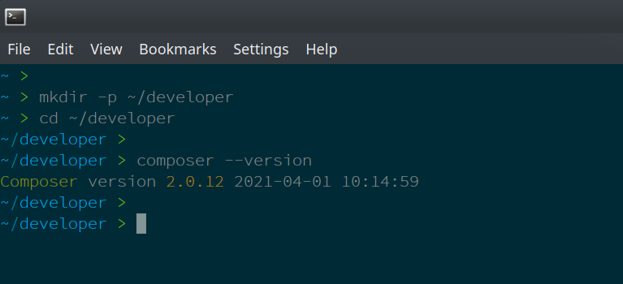

Lab Setup
#########

Project Location
................

You can put the project files anywhere you like.  If you are running this lab in a Nutanix Frame environment, the c:\developer folder has already been created for you to use.

For those following this lab outside of Nutanix frame, the following commands can be used to setup the project structure.

.. figure:: images/osx_logo_32x32.png

.. code-block:: bash

  mkdir -p ~/developer
  cd ~/developer

.. code-block:: bash

  cd %HOMEPATH%
  mkdir developer
  cd developer

Preprepared Scripts
...................

Many scripts and files throughout this lab have been prepared and stored in our Nutanix Developer Github repository.

Throughout this lab, raw source files will be shown as per the example below:

.. note::

  **Raw source file for this section, if required:** https://fakeurl.com/FakeFile404.php

In order for this lab to be successful, you will first need to install a base Laravel 6 application.

To complete this step, ensure you have PHP Composer installed and that is functioning correctly.  A quick test is to run the following command.

.. code-block:: bash

   composer --version

Now we can install the base application.  All dependencies are taken care of during this process.

.. note::

   Make sure your terminal's current directory is the "developer" directory (see steps above).

#. From a command prompt, run the following command.  Make sure you replace **<your_initials>** with your actual initials.  For example:

   .. code-block:: bash

      composer create-project --prefer-dist laravel/laravel api-app-lab-v3-<your_initials>

   .. figure:: images/create_app.png

#. Change to the new application's folder:

   .. figure:: images/linux_logo_32x32.png
   .. figure:: images/osx_logo_32x32.png

   .. code-block:: bash

      cd ~/developer/api-app-lab-v3-<your initials>

   .. figure:: images/windows_logo_32x32.png

   .. code-block:: bash

      cd c:\developer\api-app-lab-v3-<your initials>

.. note::

   Experienced Laravel developers will recognise that some of the commands below were automatically run during the project creation process.  We are running them again purely to make 100% sure all packages are up to date and that our app is ready for use.
 
#.  Run the following command.  This will make sure all required Laravel packages are installed.

    .. code-block:: bash

       composer update

    .. figure:: images/composer_update.png

#. Run the following command.  This will generate an application key, something that is required for Laravel session management.

   .. code-block:: bash

      php artisan key:generate

#. Run the following command.  The 'artisan' commands are provided with Laravel and simplify the creation of models/classes, views (etc) along with many application management features.  This command will start a local web server and make your new Laravel application available.

   .. code-block:: bash

      php artisan serve

#. Test the application by browsing to http://127.0.0.1:8000.  If your system already has a service or application listening on port 8000, you can change the port PHP listens on by modifying the command as follows:

   .. code-block:: bash

      php artisan serve --port=<port>

   If you see the Laravel default page, your base application has been installed successfully.  The default page, at the time of writing this lab, looks as follows:

   .. figure:: images/new_app_running.png

You can now continue to the next part of this lab - the app itself.
